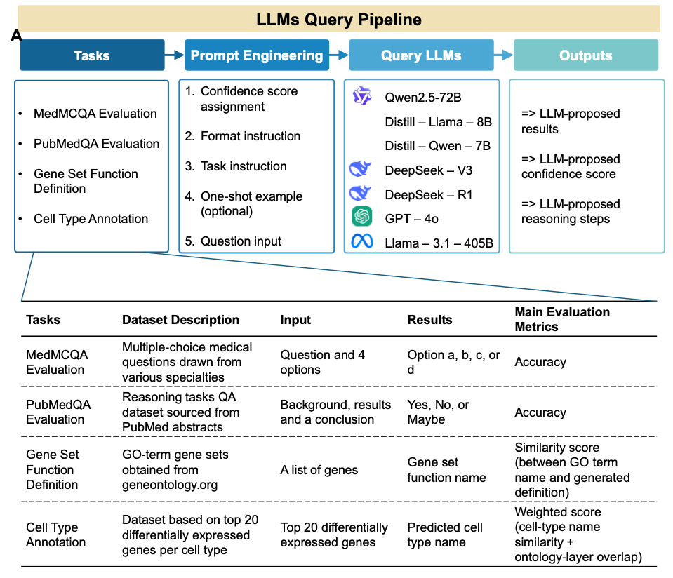

## Assessing Large Language Models for Biomedical QA and Annotation Tasks

Rapid advancements in large language models (LLMs) offer transformative potential for biomedical research. GPT-3.5, introduced in late 2022, has demonstrated proficiency comparable to undergraduate-level knowledge, while newer models like GPT-4o (released in late 2024) exhibit PhD-level knowledge mastery. Meanwhile, specialized reasoning-focused architectures, such as the recently released DeepSeek-R1, show exceptional promise for logic-intensive applications.

The rapid growth and diverse applications of LLMs underscore the need for comprehensive evaluation frameworks. Here we presents a benchmarking platform specifically tailored for biomedical tasks, which we aim to maintain and periodically update to cover increasingly more models and more benchmark tasks. 

